# 🚖 Cab Rental System — Java Desktop Application

A desktop-based vehicle rental management system built with **Java Swing** and **MySQL**. Allows customers to rent any available vehicle type, managed through a clean admin dashboard.

---

## ✨ Features

- 🔐 **Admin Dashboard** — Add, edit, and manage vehicles and view all bookings
- 👤 **Customer Management** — User signup, login, and profile with password recovery
- 🚗 **Vehicle Rental** — Browse and book any available vehicle type in real time
- 📋 **Booking History** — Separate booking history views for both admin and user
- 💳 **Payment Gateway** — Multi-step payment flow with UPI and Net Banking options

---

## 🛠️ Tech Stack

| Layer | Technology |
|---|---|
| Language | Java (JDK 8+) |
| UI Framework | Java Swing |
| Database | MySQL |
| DB Connectivity | JDBC |

---

## 📁 Project Structure

```
Java-Cab-Booking-Desktop-Application/
├── src/
│   ├── db/                             # Database connection
│   ├── libs/                           # External JAR libraries
│   ├── myuploads/                      # Uploaded images
│   │
│   ├── Welcome.java                    # Landing screen
│   ├── startpanel.java                 # Start panel
│   ├── global.java                     # Global variables & session
│   ├── Demo1.java                      # Entry point
│   │
│   ├── — Admin —
│   ├── AdminLogin.java                 # Admin login
│   ├── AdminHome.java                  # Admin dashboard
│   ├── AdminAddCar.java                # Add new vehicle
│   ├── AdminEditCars.java              # Edit vehicle details
│   ├── AdminManageCars.java            # View & manage all vehicles
│   ├── AdminBookingHistory.java        # View all bookings
│   ├── AdminChangePassword.java
│   ├── AdminForgotPassword.java
│   │
│   ├── — User —
│   ├── UserLogin.java                  # User login
│   ├── UserSignup.java                 # User registration
│   ├── UserHome.java                   # User dashboard
│   ├── UserBookingHistory.java         # User's rental history
│   ├── UserChangePassword.java
│   ├── UserForgotPassword.java
│   │
│   ├── — Booking —
│   ├── BookingSelect.java              # Select vehicle for booking
│   ├── BookingFinal.java               # Confirm booking details
│   ├── booking.java                    # Booking logic
│   ├── car_details.java                # Vehicle details view
│   │
│   ├── — Payment —
│   ├── Paygate1.java                   # Payment gateway step 1
│   ├── Paygate2.java                   # Payment gateway step 2
│   ├── Paygate2_NetB.java              # Net banking
│   ├── Paygate2_UPI.java               # UPI payment
│   ├── Paygate3.java                   # Payment confirmation
│   │
│   └── — UI Utilities —
│       ├── CarDesign.java              # Custom car card UI
│       ├── BlurLab.java / blurpanel.java  # Blur effect
│       ├── ArrowIcon.java              # Custom arrow icon
│       ├── ImgScaling.java             # Image scaling utility
│       ├── mybuttondesign.java         # Custom button style
│       ├── OutButton.java              # Logout button
│       └── Outlabel.java              # Custom label style
└── README.md
```

---

## 🗄️ Database Schema

Database name: `cabbooking`

**admin**
```sql
CREATE TABLE admin (
    email    VARCHAR(50) PRIMARY KEY NOT NULL,
    password VARCHAR(50) NOT NULL
);
```

**user**
```sql
CREATE TABLE user (
    email    VARCHAR(150) PRIMARY KEY NOT NULL,
    username VARCHAR(100) NOT NULL,
    password VARCHAR(100) NOT NULL,
    mobileno VARCHAR(100) NOT NULL,
    gender   VARCHAR(100) NOT NULL
);
```

**car_details**
```sql
CREATE TABLE car_details (
    Car_id                     INT AUTO_INCREMENT PRIMARY KEY NOT NULL,
    Car_Name                   VARCHAR(100) NOT NULL,
    Brand                      VARCHAR(100) NOT NULL,
    Car_Type                   VARCHAR(100) NOT NULL,
    Fuel_Type                  VARCHAR(100) NOT NULL,
    Price_per_day_without_driver INT NOT NULL,
    Price_per_day_with_driver  INT NOT NULL,
    Security                   INT NOT NULL,
    Numberplate                VARCHAR(100) NOT NULL,
    Description                VARCHAR(5000) NOT NULL,
    Photo                      VARCHAR(100) NOT NULL
);
```

**booking**
```sql
CREATE TABLE booking (
    booking_id     INT AUTO_INCREMENT PRIMARY KEY NOT NULL,
    car_id         INT NOT NULL,
    price_per_day  INT NOT NULL,
    start_date     VARCHAR(100) NOT NULL,
    end_date       VARCHAR(100) NOT NULL,
    no_of_days     INT NOT NULL,
    total_rent     INT NOT NULL,
    name           VARCHAR(100) NOT NULL,
    mobile_no      VARCHAR(100) NOT NULL,
    address        VARCHAR(5000) NOT NULL,
    email          VARCHAR(100) NOT NULL,
    payment_status VARCHAR(100) NOT NULL,
    booking_status VARCHAR(100) NOT NULL
);
```

---

## 🚀 Getting Started

### Prerequisites

- JDK 8 or higher
- MySQL Server 5.7+
- An IDE (NetBeans (Recommended), IntelliJ IDEA or Eclipse)
- MySQL Connector/J JAR

### 1. Database Setup

1. Open MySQL and create the database:

```sql
CREATE DATABASE cabbooking;
USE cabbooking;
```

2. Import the schema:

```bash
mysql -u root -p cabbooking < db/cabbooking.sql
```

### 2. Configure DB Connection

Edit `src/db/DBLoader.java`:

```java
final String URL = "jdbc:mysql://localhost:3306/cabbooking";
final String USER = "root";
final String PASSWORD = "your_password";
```

### 3. Add MySQL Connector

Place `mysql-connector-j-x.x.x.jar` in the `libs/` folder and add it to your project's classpath.

### 4. Run the App

Compile and run `Welcome.java`, or run directly from your IDE.

---

## 📱 Screenshots

| Welcome | Admin Login | User Login |
|---|---|---|
| 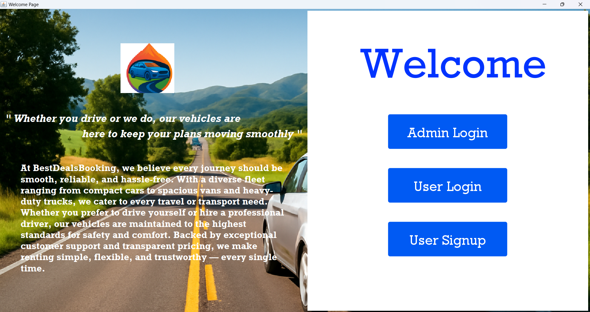 | 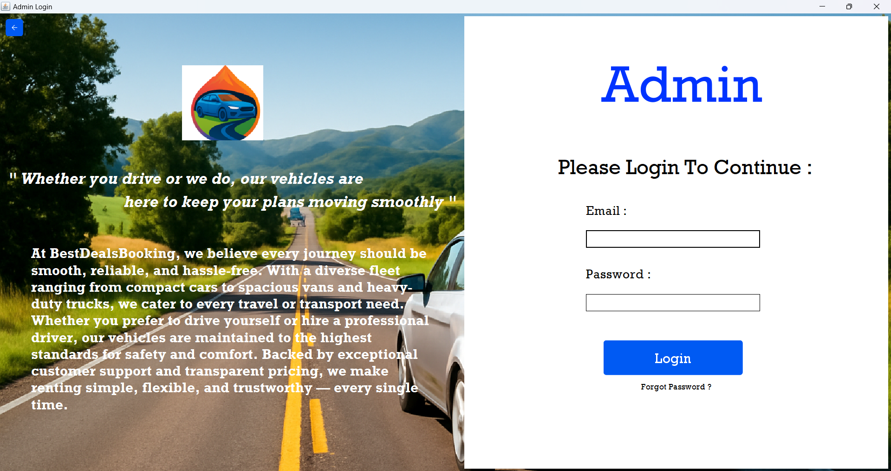 | 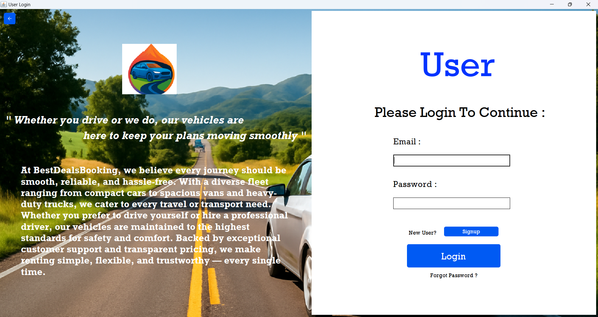 |

| User Signup | User Home | User Booking History |
|---|---|---|
| 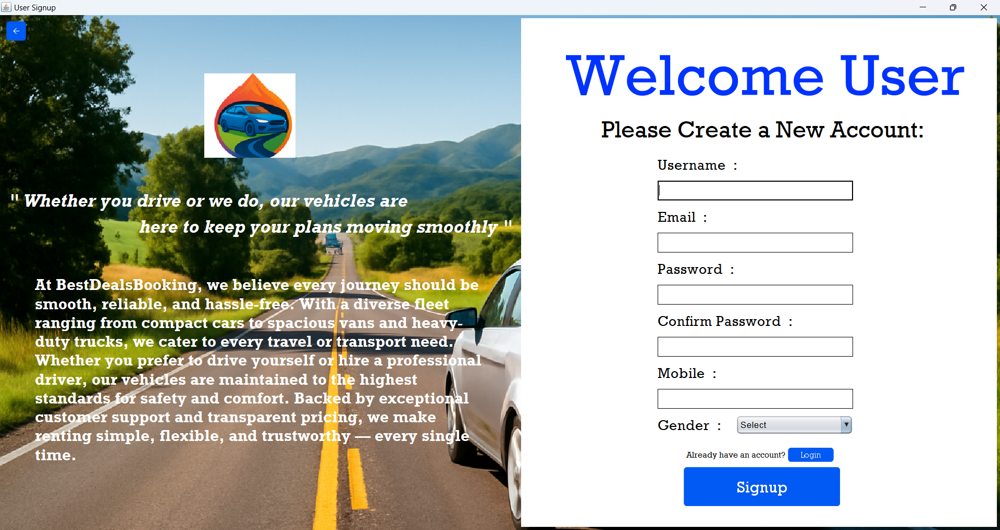 | 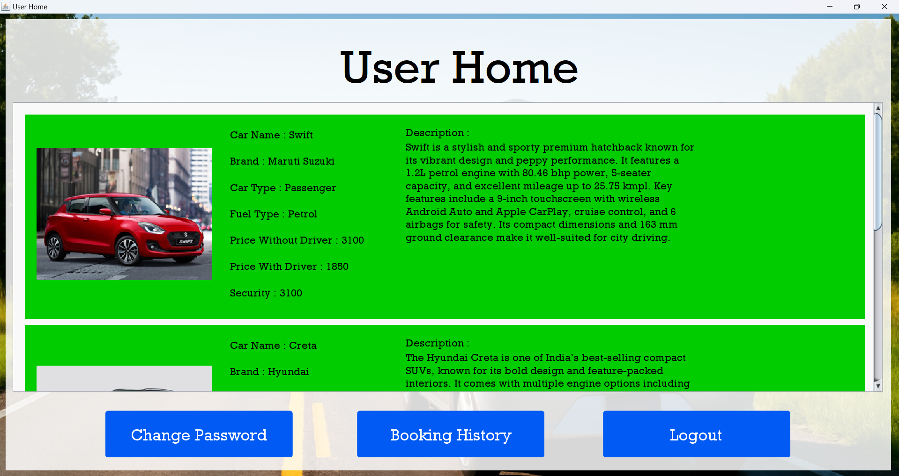 | 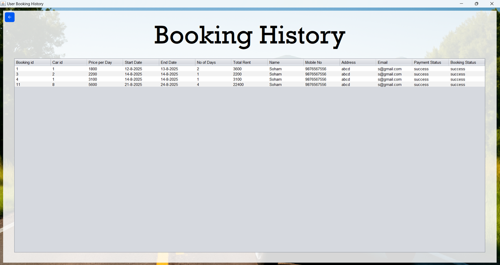 |

| User Change Password | User Forgot Password | Select Date and Price |
|---|---|---|
| 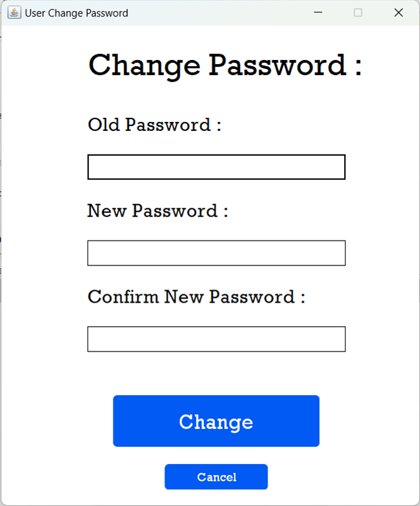 | 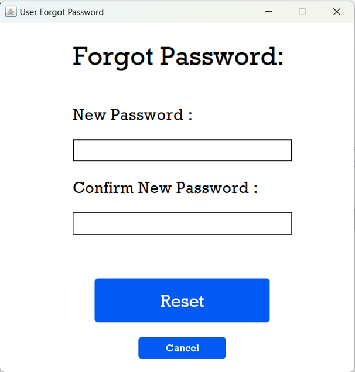 | 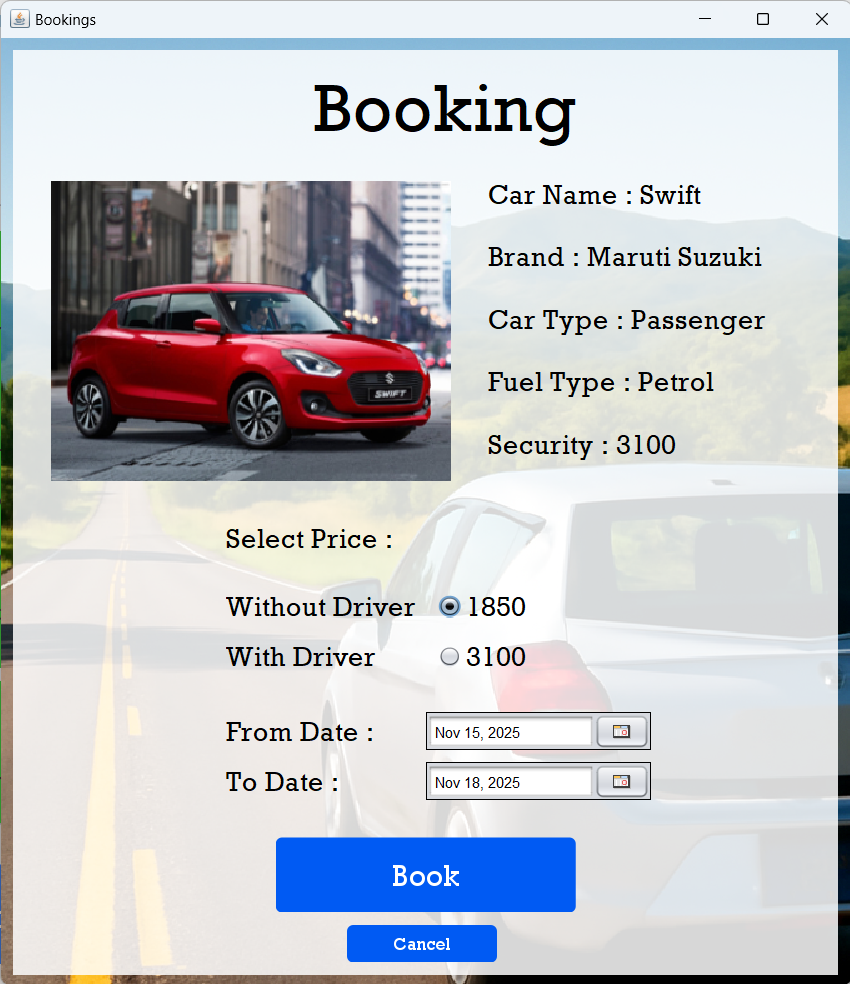 |

| Booking Submission | Admin Home Page | Admin Manage Cars |
|---|---|---|
| 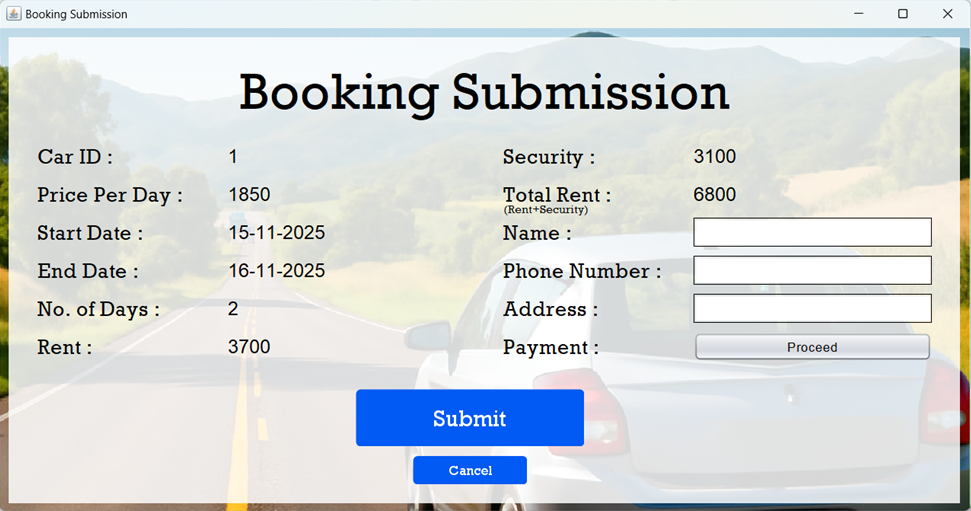 | 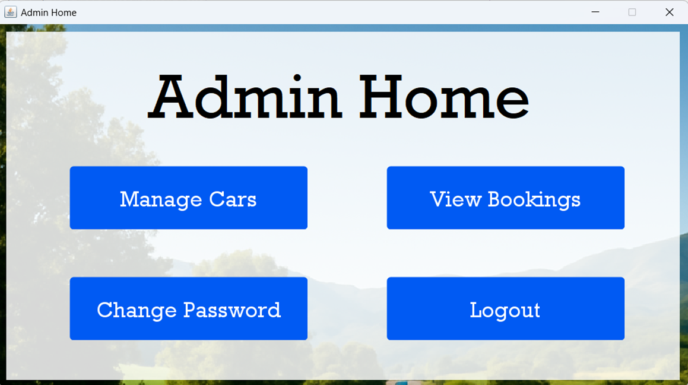 | 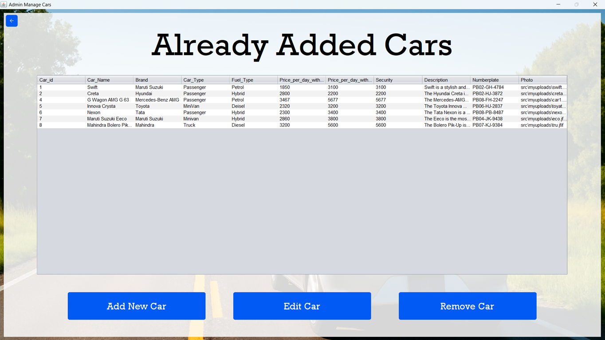 |

| Admin Booking History | Admin Change Password | Admin Forgot Password |
|---|---|---|
| 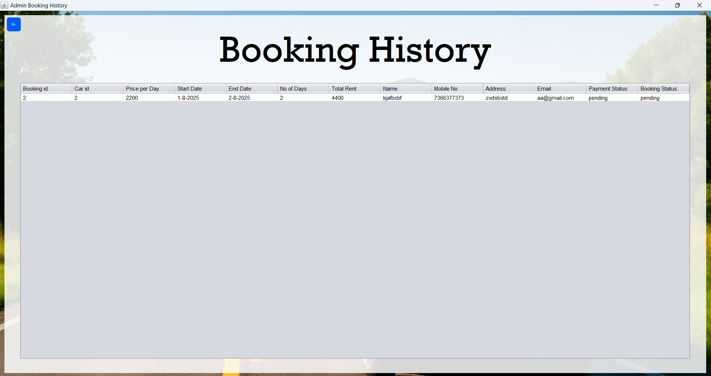 | 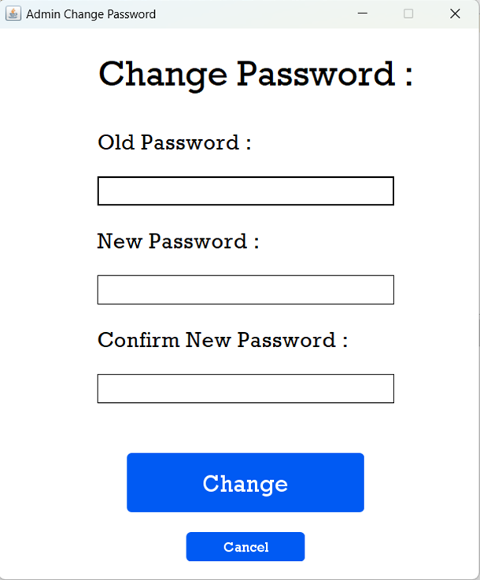 | 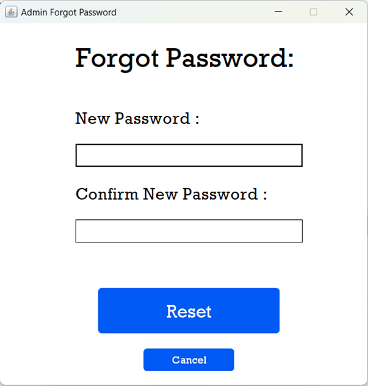 |

---

## 📄 License

This project is licensed under the [MIT License](LICENSE).

---

> Built with ☕ Java Swing & MySQL
